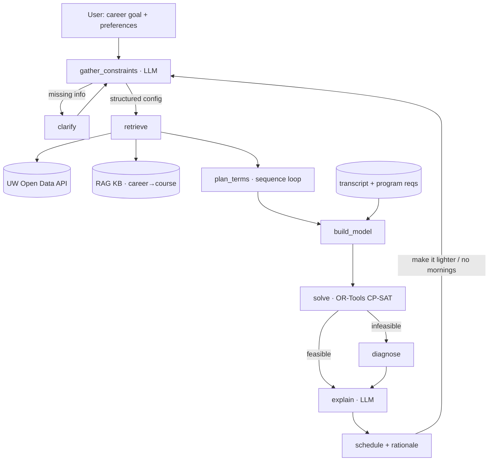

# 🪿 Schedugoose

**A conversational course-planning agent that pairs an LLM with a real optimization solver.**

Tell Schedugoose what career you're aiming for and how you like your terms (light? intense? no 8:30 AMs?), and it builds you a conflict-free, program-compliant schedule from University of Waterloo course data — **term by term across your whole co-op sequence** — then explains *why* it picked what it picked, and re-plans the moment you change your mind.

It works for **any year of student**: a brand-new first-year gets the standard 1A onward; a returning student can say *"I'm a 4th-year going into 4A"* and **upload their transcript** (PDF or text) — the plan starts at their actual term and skips everything already taken.

<p>
<a href="https://github.com/stevensun1005/Schedugoose/actions/workflows/ci.yml"></a>


</p>

---

## Quick start

```bash
python -m venv venv && venv\Scripts\activate     # Windows
# source venv/bin/activate                          # macOS / Linux
pip install -e ".[llm]"

# 1) Verify the OR core first -- no API keys needed
python -m pytest tests/test_scheduler.py

# 2) Run the eval harness (plan / intent / LLM-judge explanation axes)
python -m eval.run_eval

# 3) Run the API + chat UI
cp .env.example .env   # add GROQ_API_KEY (free at console.groq.com)
uvicorn app.main:app --reload
# open http://127.0.0.1:8000

# Optional: replay the manual chat test (server must be running)
python scripts/e2e_user_flow.py
```

The **running app is LLM-required** — every message goes through the LLM (Groq),
so set a free **`GROQ_API_KEY`** ([console.groq.com/keys](https://console.groq.com/keys),
no credit card) in `.env`. Without it, `/plan` returns a clear "set your key"
message rather than degrading to rules. Recommended: `GROQ_MODEL=llama-3.1-8b-instant`.
(Set `SCHEDUGOOSE_REQUIRE_LLM=0` to allow the rule-based fallback — used by the
**deterministic test + eval harness**, which run fully offline with zero keys and
without `UW_API_KEY`, on bundled mock data.)

To run the whole test suite: `python -m pytest`.

---

## Why Schedugoose

Picking courses isn't a lookup problem — it's a **constrained optimization problem**. Every term, students juggle a pile of conflicting conditions by hand across a dozen browser tabs:

- Is the course even **offered** this term?
- Does it **clash** with anything else?
- Are the **prerequisites** met?
- Does the overall plan **satisfy program requirements**?
- Do I want this term **light or intense**?
- Which courses are actually **relevant to the career I'm targeting**?

Schedugoose automates that. You describe your goal in plain language; it returns a schedule that satisfies every hard rule while optimizing for your soft preferences.

The core design decision — and what makes this more than another chatbot wrapper — is to **let an LLM and an optimization solver each do what they're good at, and never mix the two.**

---

## The Core Idea: LLM + OR, Cleanly Separated

| Layer | Tool | Responsibility | Why this tool |
|-------|------|----------------|---------------|
| **Semantic** | LLM | Translate fuzzy natural language ("I want to be a data scientist, keep it manageable") into structured constraints and objective weights | LLMs are great at intent, bad at exact computation |
| **Optimization** | OR-Tools CP-SAT | Solve for the optimal schedule under hard constraints | Scheduling is a 0-1 integer program — solvers are fast, exact, and never hallucinate |
| **Explanation** | LLM | Narrate the trade-offs in plain language and take the next revision | LLMs are great at language and dialogue |

Handing scheduling to the LLM directly produces three predictable failures: miscalculated time conflicts, recommendations for courses that don't exist, and constraint-juggling that falls apart as rules pile up. Those are exactly the solver's strengths. The LLM only **translates** and **explains** — the solver does the actual planning.

---

## How a conversation goes

Schedugoose plans your courses **term by term across your whole co-op sequence**,
starting from your 1A term. It runs a short guided onboarding, asking only for
what's missing:

1. **Program** — "I'm a first-year CS student" → identifies your faculty
   (Math / Engineering / Science) and degree requirements.
2. **Standing / transcript** — new first-year, or returning? Say *"I'm a 4th-year
   student"* or *"going into 2B"* and the plan **starts at your actual term**,
   not 1A. Paste the courses you've taken ("CS 135, MATH 135"), dump raw
   transcript text (grades and headers are ignored), or hit **📎 and upload the
   transcript PDF** — everything already taken is skipped. Say nothing and
   you're treated as a **brand-new first-year** — a clean schedule you can then
   edit.
3. **Residency** — international or domestic (language / English rules).
4. **Sequence / stream** — Math/CS offer **Regular** or one of **four co-op
   sequences** (Sequence 1–4, differing in when work terms fall; Seq 1 is the
   common pick — UW's actual entry sequences). Engineering is lockstep:
   **Stream 4** (earlier first work term) vs **Stream 8** (more time to settle
   in). Say "sequence 3" or "stream 8" and it's matched.
5. **Start term** — e.g. "Fall 2026" or "Winter 2027" (your 1A — or, for a
   returning student, your *next* term); the whole sequence is anchored to the
   season you give, interleaving co-op work terms.
6. **Career + preferences** — *optional*. "aiming for data science, keep it
   light, no mornings". If you don't name a career, Schedugoose won't invent one
   — it plans a solid general foundation and asks if you want to set a direction.
   If you ask for at least one easy course, it also asks which electives you'd
   like (or you can say "skip" and it picks easy ones). Then it plans every
   study term: 1A → 4B.

After onboarding, the chat handles the conversations a student actually has —
each answered in place, never by re-dumping the whole schedule:

| You say… | You get |
|----------|---------|
| "make 2A lighter" / "make 4A heavier", "no music in 1A", "swap CS 486 for CS 480", "add PHIL 145 to 3B" | a **revised** plan (re-solved; a lighter term drops to ~4 courses, a heavier one absorbs the slack without ever overshooting the 20-credit target) |
| "make 5A lighter" (no such term) | a **clarification** ("your plan runs 1A–4B"), not a silent re-dump |
| "why CS 341 in 3A?", "explain my plan" | a grounded **explanation** |
| "what is CS 246?", "prereqs for CS 486?", "CS 480 vs CS 486" | **course info** for *any* UW subject (title, prereqs, usual term, restrictions) or a side-by-side **comparison**; a made-up code gets a polite "couldn't find it" |
| "what courses for data science?" | **career advice** grounded in the real catalog, prereqs shown, degree-required basics excluded |
| "what does the AI specialization require?", "mechatronics requirements?" | **requirements** quoted **verbatim from the UW academic calendar** (Kuali API), with a citation link — never LLM-paraphrased |
| "im a 4th year student", "going into 2B" + pasted/uploaded transcript | a plan that **starts at your term** and skips completed courses |
| "show my plan", "when do I graduate?", "when are my work terms?", "which term is hardest?", "what electives can I take?" | **plan facts** read straight from the plan (deterministic, no hallucination) |
| "change my start to Winter 2027", "switch to sequence 2" | **profile change** → re-planned |
| "start over" | a fresh session |
| "hi" / "thanks" / "what's the weather?" | a friendly reply / a scope redirect |

Each study term is an independent CP-SAT solve (conflict-free, within your
course-load); prerequisites unlock as earlier terms complete; courses are steered
toward unmet degree requirements and RAG career grounding.

### Grounding discipline (why it doesn't hallucinate)

Small models *will* invent course codes and titles if you let them narrate
freely — "CS 442: Machine Learning" sounds plausible and is completely wrong.
Schedugoose treats this as an architecture problem, not a prompt problem:

- **The LLM never enumerates courses from its own knowledge.** The only
  free-text LLM reply path is the revision acknowledgment ("removed MATH 239
  from 2A — done"). Everything that lists courses is rendered from the plan
  JSON, the real catalog, or a cited source.
- **Requirements are returned verbatim.** Program/specialization requirements
  come from the UW academic-calendar (Kuali) API and are quoted exactly, with a
  link — never summarized by the model (summaries invent counts and codes).
- **Facts stay exact through phrasing.** When the LLM does phrase an answer
  (graduation date, workload), it phrases *around* deterministic facts computed
  from the plan (`grounded_reply`), so numbers and codes can't drift.
- **Recommendations carry their prerequisites** and never include courses your
  degree already requires (you have to take those anyway) or courses already in
  your plan.
- The chat UI shows an AI badge per reply (understood / explained / rules-only),
  so you can always see which layer produced the text.

---

## Architecture



In one line: **natural language → structured constraints → fetch course data →
build model → solve → explain → iterate.** Each step is a LangGraph node;
conditional edges handle clarification and infeasibility. `run_turn` mirrors the
same edges functionally, so the agent runs with or without LangGraph installed.

---

## Data Sources

| Data | Source | Compliance |
|------|--------|------------|
| Courses, sections, times, instructors, capacity | **UW Open Data API v3** (official, API key) with bundled **mock catalog fallback** | Authoritative — no scraping required |
| **Any program's requirements** (Engineering, Science, Health, Econ, …) | Fetched **on demand** from the UW academic-calendar **Kuali API** (`data/kuali.py`) for authoritative "Complete N of…" requirements, with a course-page RAG fallback (`data/calendar.py`, `data/requirements_rag.py`) — not hardcoded | Public |
| CS majors / all 8 CS specializations / minors | Curated + source-cited (`data/degree_requirements.py`) — verified fast path for the common case | Public |
| **Standard first-year courses + recommended timelines** | UW advising pages (curated, with source links) | Public |
| Career → skills → courses mapping | Self-built knowledge base (RAG) | Owned |
| Course difficulty / workload | Workload-balance signal | Optional, source-checked |

Core course data comes from Waterloo's **official Open Data API** — fully
sanctioned, no scraping. Without `UW_API_KEY` the planner transparently falls
back to a bundled mock catalog, so the whole system runs offline. Difficulty
signals are handled separately and treated as optional (see
[Notes & Compliance](#notes--compliance)).

**Program knowledge** (`data/program_templates.py`) curates each program's
**standard first-year courses** and a **recommended term-by-term timeline**
(when CS 246, STAT 230, CS 341, … are normally taken), distilled from UW's
[new-math-students](https://uwaterloo.ca/new-math-students/course-selection) and
[CS suggested-sequence](https://cs.uwaterloo.ca/suggested-sequences) advising
pages (sources are cited in the file). The planner **pins first year to the
official template** for catalog-supported programs, the advisor cites it ("the
standard first year for Software Engineering is…"), and course Q&A reports when a
course is normally taken.

---

## GenAI & MLOps engineering

Beyond the planner, the repo is built like a production GenAI service:

| Concern | Implementation |
|---------|----------------|
| **ETL ingestion** | `data/etl.py` + `scripts/etl_courses.py` — extract course/program docs → **chunk** (`data/chunking.py`) → **embed** (`data/embeddings.py`) → **load** to a JSON or MongoDB vector store |
| **Hybrid RAG** | `data/rag_store.py` fuses **BM25 (lexical)** + **dense embeddings (semantic)** via **Reciprocal Rank Fusion** — catches exact terms *and* paraphrases |
| **Vector store** | MongoDB Atlas `$vectorSearch` when configured, else an in-repo cosine index; OpenAI embeddings with a deterministic local fallback so dev/CI runs offline |
| **Agents & orchestration** | LangGraph multi-node agent (`gather → clarify → retrieve → plan_terms → solve → diagnose → explain`) with a functional fallback |
| **APIs** | FastAPI `/plan`, `/transcript` (PDF/text upload → completed courses), `/feedback`, `/health`, `/metrics` — GenAI model behind a clean HTTP surface |
| **Observability** | `app/metrics.py` — request/latency counters, **LLM-usage vs rule-based fallback rate**, RAG-source mix; `/metrics` serves JSON or Prometheus |
| **Semantic course search** | `data/vector_store.py` consumes the ETL store (load-or-build) — "which courses cover databases?" → CS 348, via hybrid dense + lexical search |
| **Finetuning data** | `data/feedback.py` — the `/plan` route logs LLM turns and `/feedback` records 👍/👎; `scripts/export_sft.py` exports a **reward-filtered SFT dataset** (chat format) for LoRA/SFT |
| **Containers** | `Dockerfile` (+ healthcheck) and `docker-compose.yml` (API + Redis + MongoDB) |
| **CI/CD quality gate** | `.github/workflows/ci.yml` runs pytest **and the eval harness** on every push/PR (across Python 3.11/3.12) and builds the image — the OR core's 100% plan-correctness is a hard gate |

Run the ingestion pipeline: `python -m scripts.etl_courses --out data/vector_store.json`

---

## Data Model

API responses are normalized into a few core objects (`scheduler/types.py`):

```python
@dataclass(frozen=True)
class TimeSlot:
    weekdays: str      # "TTh", "MWF"
    start: int         # minutes since midnight, e.g. 16:00 -> 960
    end: int

@dataclass(frozen=True)
class Section:
    course_id: str     # "CS 486"
    component: str      # "LEC" | "TUT" | "LAB"
    section_code: str   # "LEC 001"
    times: tuple[TimeSlot, ...]
    instructor: str
    term: str
    cap: int
    enrolled: int

@dataclass
class Course:
    course_id: str
    title: str
    units: float
    prereqs: list[str]
    sections: list[Section]
    career_relevance: float   # 0–1, computed per target career
    easiness: float           # 0–1, workload signal (higher = lighter)
    prof_rating: float        # 0–1, instructor-quality signal
    categories: list[str]     # program / KB tags
```

**Key trick:** store times as minutes since midnight, so detecting a clash
between two sections reduces to a simple interval-overlap check when generating
constraints.

---

## The Optimization Model

The mathematical core. Built and tested **with mock data first**, fully decoupled
from the LLM.

### Decision variables

A course has multiple components (LEC/TUT/LAB), each with multiple sections — so we model at the **section level**:

- `x[s] ∈ {0,1}` — section `s` is selected, for `s ∈ S` (candidates, pre-filtered by term + prerequisites)
- `y[c] ∈ {0,1}` — course `c` is in the schedule (auxiliary, linked to its sections)

### Hard constraints

**(H1) Course–section linking** — if a course is taken, exactly one section of each required component is taken:

```
for each course c, for each component type t (LEC/TUT/LAB):
    Σ_{s in c, component=t} x[s] = y[c]
```

**(H2) No time conflicts** — precompute every overlapping section pair into `Conflicts`:

```
for each (s, s') in Conflicts:
    x[s] + x[s'] ≤ 1
```

**(H2b) Antirequisites** — mutually-exclusive courses (e.g. STAT 206 vs STAT 230/240) parsed from the `Antireq:` clause: at most one of a pair, `y[c] + y[c'] ≤ 1` (and dropped in pre-filtering if the antireq is already on the transcript).

**(H3) Credit load**

```
L ≤ Σ_c units[c] · y[c] ≤ U          # e.g. L = 2.0, U = 2.5
```

**(H4) Program requirement coverage** — for each requirement category `R`:

```
Σ_{c in R} y[c] ≥ required_count[R]
```

**(H5) Must-include / must-avoid**

```
y[c] = 1   for each must-include course
y[c] = 0   for each must-avoid course
```

**(H6) Prerequisites, enrollment restrictions & term** — handled in **pre-filtering**, not in the solver: drop courses whose prereqs aren't met (against the transcript / earlier terms), drop courses the student isn't *eligible* for (UW lists `"<program> students only"` clauses — e.g. STAT 206 is Software-Eng-only and must never appear for a CS student), and keep only sections actually offered in the target term. Simpler and faster than encoding as constraints. Prereq/restriction text is parsed from the live `requirementsDescription` field (carrying a subject across listed numbers, like `"One of CS 240, 245, 246"`, à la UWFlow's importer).

### Objective (soft preferences)

```
maximize
    Σ_c y[c] · ( w_career  · career_relevance[c]
               + w_easy    · easiness[c]
               + w_prof     · prof_rating[c] )
  − w_morning · Σ_{s is early}   x[s]
  − w_friday  · Σ_{s on Friday}  x[s]
  − w_gap     · (fragmented-time penalty, optional)
```

All weights `w_*` are produced by the **LLM semantic layer**: "keep it light" raises `w_easy`; "no early classes" raises `w_morning`.

### Solver sketch (OR-Tools CP-SAT)

```python
from ortools.sat.python import cp_model

def solve(courses, conflicts, program_reqs, config):
    m = cp_model.CpModel()
    x = {s.id: m.NewBoolVar(s.id) for c in courses for s in c.sections}
    y = {c.course_id: m.NewBoolVar(c.course_id) for c in courses}

    for c in courses:                                    # H1
        for comp in c.components():
            m.Add(sum(x[s.id] for s in c.sections_of(comp)) == y[c.course_id])
    for s1, s2 in conflicts:                             # H2
        m.Add(x[s1] + x[s2] <= 1)
    m.Add(sum(int(c.units*10)*y[c.course_id] for c in courses) >= int(config.min*10))  # H3
    m.Add(sum(int(c.units*10)*y[c.course_id] for c in courses) <= int(config.max*10))
    for R, n in program_reqs.items():                    # H4
        m.Add(sum(y[c] for c in R) >= n)
    for c in config.must_include: m.Add(y[c] == 1)       # H5
    for c in config.must_avoid:   m.Add(y[c] == 0)

    obj = sum(y[c.course_id] * score(c, config.weights) for c in courses) \
        - config.weights.morning * sum(x[s.id] for s in early_sections) \
        - config.weights.friday  * sum(x[s.id] for s in friday_sections)
    m.Maximize(obj)

    solver = cp_model.CpSolver()
    status = solver.Solve(m)
    return extract_schedule(status, solver, x, y)
```

With a few dozen to a few hundred candidate courses, CP-SAT solves in milliseconds — fast enough to power the "change one sentence, get a new schedule" loop.

### When there's no solution

Over-tight constraints ("only easy courses + must satisfy program + avoid all mornings") can be infeasible. Instead of erroring out, Schedugoose runs an **infeasibility diagnosis** — relaxing soft constraints to find which hard constraints conflict — so the explanation layer can say *"your 'avoid all mornings' and 'finish the AI specialization' can't both hold — want to loosen one?"* That's a far better experience than a bare "no solution."

---

## LLM Semantic Layer

The LLM emits a structured solver config via structured output:

```json
{
  "target_categories": ["CS-AI-4xx", "STAT-ML"],
  "credit_load": {"min": 2.0, "max": 2.5},
  "weights": {"career": 0.5, "easy": 0.3, "prof": 0.2,
              "morning": 0.4, "friday": 0.2},
  "time_prefs": {"avoid_before": "10:00", "avoid_friday": true},
  "must_include": ["CS 486"],
  "must_avoid": []
}
```

**Career → courses is RAG-grounded, never free-form.** The LLM is never allowed to invent course codes. Instead:

1. Embed the user's career goal
2. Retrieve from the knowledge base (program requirements + a curated career→skills→course map)
3. Let the LLM pick `target_categories` and score `career_relevance` **only within the real course codes that came back**

Knowledge-base entry example:

```
data scientist → [statistical inference, machine learning, data wrangling, SQL]
              → [STAT 231, STAT 341, CS 486, CS 451, ...]
```

Weights are mapped from vague phrasing via few-shot anchors ("keep it light" → `easy: 0.5`; "I want a challenge" → `career: 0.6, easy: 0.1`).

---

## LangGraph Orchestration

**State** (`agent/state.py`)

```python
class PlannerState(TypedDict, total=False):
    messages: list
    profile: dict                 # transcript, program, term
    intake: dict                  # onboarding answers gathered so far
    config: dict | None           # LLM-produced solver config
    plan: dict | None             # full term-by-term sequence plan
    needs_clarification: bool
    explanation: str
```

**Nodes**

| Node | Type | Role |
|------|------|------|
| `gather_constraints` | LLM | NL → config + intake; flags missing info |
| `clarify` | LLM | Asks for missing details (program? term? load? electives?) |
| `retrieve` | tool | UW API fetch + RAG relevance scoring |
| `plan_terms` | pure fn | Loops the whole sequence, solving each study term |
| `build_model` | pure fn | candidates + profile → IP model |
| `solve` | tool | OR-Tools solve (deterministic, not an LLM call) |
| `diagnose` | tool | Locate the tightest constraint when infeasible |
| `explain` | LLM | Schedule + trade-offs → natural language |

**Conditional edges** route clarification (`gather → clarify → gather`),
infeasibility (`solve → diagnose → explain`), and revision (`explain → gather`,
re-weighting and re-solving). Session state is held in process memory and can be
persisted in **Redis** (`REDIS_URL`) for multi-turn memory across restarts.

---

## Repository Structure

```
schedugoose/
├── README.md
├── pyproject.toml
├── .env.example                # UW_API_KEY, GROQ_API_KEY, REDIS_URL, ...
├── app/
│   ├── main.py                 # FastAPI entrypoint + chat UI (transcript 📎 upload)
│   ├── routes.py               # /plan /transcript /feedback /health /metrics
│   ├── metrics.py              # request/latency/LLM-usage observability
│   └── sessions.py             # session memory (in-process / Redis)
├── agent/
│   ├── graph.py                # LangGraph assembly + functional run_turn
│   ├── intake.py               # onboarding state machine
│   ├── understand.py           # turn-intent classification
│   ├── semantic.py             # NL → solver config
│   ├── planner.py              # term-by-term sequence solve
│   ├── advisory.py / career.py / course_qa.py / requirements_qa.py
│   ├── plan_qa.py              # help, plan facts, workload, reset, off-topic
│   ├── llm.py                  # Groq-first LLM client (graceful degradation)
│   └── nodes/
│       ├── gather.py  retrieve.py  plan_terms.py
│       ├── build_model.py  solve_schedule.py  diagnose.py  explain.py
├── scheduler/                  # OR core — independently testable, no LLM
│   ├── types.py                # data model
│   ├── model.py                # IP modeling
│   ├── solve.py                # CP-SAT solve + infeasibility diagnosis
│   └── conflicts.py            # time-conflict preprocessing
├── data/
│   ├── uw_api.py               # API wrapper + normalization (+ mock fallback)
│   ├── mock_data.py            # bundled offline catalog
│   ├── etl.py                  # extract→chunk→embed→load ingestion pipeline
│   ├── chunking.py             # document chunking   embeddings.py  # dense+BM25
│   ├── feedback.py             # interaction logging → SFT dataset export
│   ├── rag_store.py            # hybrid RAG (BM25 + dense + RRF; Mongo vector)
│   ├── degree_plans.py  program_reqs.py  sequences.py  electives.py
│   ├── kuali.py                # UW academic-calendar (Kuali) API — authoritative reqs
│   ├── calendar.py             # on-demand UW calendar fetch (any subject)
│   ├── requirements_rag.py     # retrieve program requirements from UW (RAG)
│   ├── degree_requirements.py  # curated CS majors/minors/specializations (cited)
│   ├── program_templates.py    # standard first-year + recommended timelines (UW)
│   ├── prereqs.py              # requirementsDescription → prereq codes
│   ├── restrictions.py         # "<program> students only" eligibility (H6)
│   └── prefilter.py  course_codes.py  term_codes.py  cache.py
├── eval/
│   ├── test_cases.jsonl        # multi-turn onboarding conversations
│   ├── checker.py              # machine-verifiable plan checker
│   ├── judge.py                # LLM-as-judge (rule fallback) for faithfulness
│   └── run_eval.py
├── scripts/
│   └── e2e_user_flow.py        # step-by-step replay of a real chat session
└── tests/                      # 164 deterministic tests (scheduler + agent + API)
```

`scheduler/` is deliberately decoupled from the LLM so it can be unit-tested on
its own — the practical expression of "get the core working first."

---

## Build phases (all shipped)

| Phase | Deliverable | Status |
|-------|-------------|--------|
| **0** | Env + skeleton (FastAPI + LangGraph + Redis hello-world) | ✅ |
| **1 ⭐** | **OR core**: pull a term's data, normalize, conflict preprocessing, solve with a *hand-written* config, unit tests. Milestone: correct schedules with **no LLM involved** | ✅ |
| **2** | LLM semantic layer: NL → config via structured output | ✅ |
| **3** | RAG knowledge base: program reqs + career→course, relevance scoring | ✅ |
| **4** | LangGraph orchestration: clarify / diagnose edges, session memory | ✅ |
| **5** | Explanation layer + "change one sentence, re-plan" loop | ✅ |
| **6** | Eval harness (3 axes, CI quality gate) | ✅ |
| **7** | Conversation layer: any-year students, transcript upload, course Q&A/comparison, per-term load, live-calendar requirements | ✅ |

> **Golden rule: don't add the LLM until the Phase 1 core works.** Building the solver on top of LLM output instead of the reverse is painful to debug.

---

## Evaluation

A set of multi-turn test conversations (`eval/test_cases.jsonl`), scored on three axes by `python -m eval.run_eval`:

1. **Constraint correctness** — does each returned schedule actually have zero conflicts and satisfy credit + program rules? This is **machine-verifiable** with a checker over the solution, and sits at 100% — hard evidence of reliability.
2. **Intent-mapping accuracy** — does the LLM translate language into the right config (categories, weight direction, sequence, residency)?
3. **Explanation faithfulness** — LLM-as-judge check (with a deterministic rule fallback when offline) that the narration reflects the actual plan and invents no course codes.

The harness runs fully offline (rule-based layers) so it is deterministic in CI; with `GROQ_API_KEY` set it exercises the live LLM layers.

---

## Highlights

- **LLM + integer programming, not LLM-as-everything.** An LLM semantic layer maps natural-language career goals into structured constraints; an OR-Tools CP-SAT scheduler produces conflict-free, program-compliant schedules optimizing career-relevance and workload objectives.
- **Grounded, not hallucinated.** Course data comes from the official UW Open Data API, program requirements verbatim from the UW academic-calendar (Kuali) API, career→course recommendations RAG-grounded in real requirements — the LLM never enumerates courses from its own knowledge (see [Grounding discipline](#grounding-discipline-why-it-doesnt-hallucinate)).
- **Conversational and iterative.** LangGraph orchestrates multi-turn planning, infeasibility diagnosis, and millisecond re-optimization in response to plain-language edits ("make it lighter / no early mornings"). Any year of student: "I'm a 4th-year going into 4A" + a transcript upload plans only what's left.
- **Verified.** 164 deterministic tests and a 3-axis eval harness (plan correctness, intent mapping, explanation faithfulness) at 100%, run as a hard CI gate on every push.

---

## Notes & Compliance

- **Career → courses stays RAG-grounded** on real course codes; the LLM never free-associates course numbers.
- **Workload balancing, framed as such** — the difficulty objective optimizes for a balanced workload, not "easy courses."
- **Difficulty data is optional and source-checked** — core functionality never hard-depends on third-party review data; review terms of use before integrating any.
- **Solver before LLM** — the integer-programming core is the foundation everything else sits on.
- **Respect API limits** — UW Open Data has rate limits; retrieval results are cached.

---

## License

MIT — see [LICENSE](LICENSE).

> Named after the geese of the University of Waterloo, who have strong opinions about where everyone should be and when. 🪿
