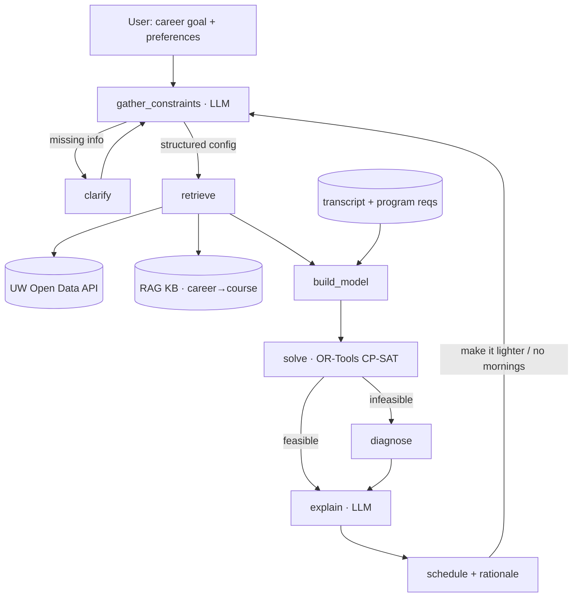

# 🪿 Schedugoose

**A conversational course-planning agent that pairs an LLM with a real optimization solver.**

Tell Schedugoose what career you're aiming for and how you like your terms (light? intense? no 8:30 AMs?), and it builds you a conflict-free, program-compliant schedule from live University of Waterloo course data — then explains *why* it picked what it picked, and re-plans the moment you change your mind.

<p>


</p>

---

## Why Schedugoose

Picking courses isn't a lookup problem — it's a **constrained optimization problem**. Every term, students juggle a pile of conflicting conditions by hand across a dozen browser tabs:

- Is the course even **offered** this term?
- Does it **clash** with anything else?
- Are the **prerequisites** met?
- Does the overall plan **satisfy program requirements**?
- Do I want this term **light or intense**?
- Which courses are actually **relevant to the career I'm targeting**?

Schedugoose automates that. You describe your goal in plain language; it returns a schedule that satisfies every hard rule while optimizing for your soft preferences.

The core design decision — and what makes this more than another chatbot wrapper — is to **let an LLM and an optimization solver each do what they're good at, and never mix the two.**

---

## The Core Idea: LLM + OR, Cleanly Separated

| Layer | Tool | Responsibility | Why this tool |
|-------|------|----------------|---------------|
| **Semantic** | LLM | Translate fuzzy natural language ("I want to be a data scientist, keep it manageable") into structured constraints and objective weights | LLMs are great at intent, bad at exact computation |
| **Optimization** | OR-Tools CP-SAT | Solve for the optimal schedule under hard constraints | Scheduling is a 0-1 integer program — solvers are fast, exact, and never hallucinate |
| **Explanation** | LLM | Narrate the trade-offs in plain language and take the next revision | LLMs are great at language and dialogue |

Handing scheduling to the LLM directly produces three predictable failures: miscalculated time conflicts, recommendations for courses that don't exist, and constraint-juggling that falls apart as rules pile up. Those are exactly the solver's strengths. The LLM only **translates** and **explains** — the solver does the actual planning.

---

## Architecture



In one line: **natural language → structured constraints → fetch course data → build model → solve → explain → iterate.** Each step is a LangGraph node; conditional edges handle clarification and infeasibility.

---

## Data Sources

| Data | Source | Compliance |
|------|--------|------------|
| Courses, sections, times, instructors, capacity | **UW Open Data API v3** (official, API key) | Authoritative — no scraping required |
| Program / graduation requirements | Undergraduate calendar (curated) | Public |
| Career → skills → courses mapping | Self-built knowledge base | Owned |
| Course difficulty / workload | Student-review data | Review source terms before use |

Core course data comes from Waterloo's **official Open Data API** — fully sanctioned, no scraping. Difficulty signals are handled separately and treated as optional (see [Notes & Compliance](#notes--compliance)).

---

## Data Model

API responses are normalized into a few core objects:

```python
@dataclass
class TimeSlot:
    weekdays: str      # "TTh", "MWF"
    start: int         # minutes since midnight, e.g. 16:00 -> 960
    end: int

@dataclass
class Section:
    course_id: str     # "CS 486"
    component: str      # "LEC" | "TUT" | "LAB"
    section_code: str   # "LEC 001"
    times: list[TimeSlot]
    instructor: str
    term: str
    cap: int
    enrolled: int

@dataclass
class Course:
    course_id: str
    title: str
    units: float
    prereqs: list[str]
    sections: list[Section]
    career_relevance: float   # 0–1, computed per target career
    easiness: float           # 0–1, workload signal
```

**Key trick:** store times as minutes since midnight, so detecting a clash between two sections reduces to a simple interval-overlap check when generating constraints.

---

## The Optimization Model

The mathematical core. Build and test this **with mock data first**, before any LLM is involved.

### Decision variables

A course has multiple components (LEC/TUT/LAB), each with multiple sections — so we model at the **section level**:

- `x[s] ∈ {0,1}` — section `s` is selected, for `s ∈ S` (candidates, pre-filtered by term + prerequisites)
- `y[c] ∈ {0,1}` — course `c` is in the schedule (auxiliary, linked to its sections)

### Hard constraints

**(H1) Course–section linking** — if a course is taken, exactly one section of each required component is taken:

```
for each course c, for each component type t (LEC/TUT/LAB):
    Σ_{s in c, component=t} x[s] = y[c]
```

**(H2) No time conflicts** — precompute every overlapping section pair into `Conflicts`:

```
for each (s, s') in Conflicts:
    x[s] + x[s'] ≤ 1
```

**(H3) Credit load**

```
L ≤ Σ_c units[c] · y[c] ≤ U          # e.g. L = 2.0, U = 2.5
```

**(H4) Program requirement coverage** — for each requirement category `R`:

```
Σ_{c in R} y[c] ≥ required_count[R]
```

**(H5) Must-include / must-avoid**

```
y[c] = 1   for each must-include course
y[c] = 0   for each must-avoid course
```

**(H6) Prerequisites & term** — handled in **pre-filtering**, not in the solver: drop courses whose prereqs aren't met (against the transcript) and keep only sections actually offered in the target term. Simpler and faster than encoding as constraints.

### Objective (soft preferences)

```
maximize
    Σ_c y[c] · ( w_career  · career_relevance[c]
               + w_easy    · easiness[c]
               + w_prof     · prof_rating[c] )
  − w_morning · Σ_{s is early}   x[s]
  − w_friday  · Σ_{s on Friday}  x[s]
  − w_gap     · (fragmented-time penalty, optional)
```

All weights `w_*` are produced by the **LLM semantic layer**: "keep it light" raises `w_easy`; "no early classes" raises `w_morning`.

### Solver sketch (OR-Tools CP-SAT)

```python
from ortools.sat.python import cp_model

def solve(courses, conflicts, program_reqs, config):
    m = cp_model.CpModel()
    x = {s.id: m.NewBoolVar(s.id) for c in courses for s in c.sections}
    y = {c.course_id: m.NewBoolVar(c.course_id) for c in courses}

    for c in courses:                                    # H1
        for comp in c.components():
            m.Add(sum(x[s.id] for s in c.sections_of(comp)) == y[c.course_id])
    for s1, s2 in conflicts:                             # H2
        m.Add(x[s1] + x[s2] <= 1)
    m.Add(sum(int(c.units*10)*y[c.course_id] for c in courses) >= int(config.min*10))  # H3
    m.Add(sum(int(c.units*10)*y[c.course_id] for c in courses) <= int(config.max*10))
    for R, n in program_reqs.items():                    # H4
        m.Add(sum(y[c] for c in R) >= n)
    for c in config.must_include: m.Add(y[c] == 1)       # H5
    for c in config.must_avoid:   m.Add(y[c] == 0)

    obj = sum(y[c.course_id] * score(c, config.weights) for c in courses) \
        - config.weights.morning * sum(x[s.id] for s in early_sections) \
        - config.weights.friday  * sum(x[s.id] for s in friday_sections)
    m.Maximize(obj)

    solver = cp_model.CpSolver()
    status = solver.Solve(m)
    return extract_schedule(status, solver, x, y)
```

With a few dozen to a few hundred candidate courses, CP-SAT solves in milliseconds — fast enough to power the "change one sentence, get a new schedule" loop.

### When there's no solution

Over-tight constraints ("only easy courses + must satisfy program + avoid all mornings") can be infeasible. Instead of erroring out, Schedugoose runs an **infeasibility diagnosis** — relaxing soft constraints or using CP-SAT assumptions to find which hard constraints conflict — so the explanation layer can say *"your 'avoid all mornings' and 'finish the AI specialization' can't both hold — want to loosen one?"* That's a far better experience than a bare "no solution."

---

## LLM Semantic Layer

The LLM emits a structured solver config via structured output:

```json
{
  "target_categories": ["CS-AI-4xx", "STAT-ML"],
  "credit_load": {"min": 2.0, "max": 2.5},
  "weights": {"career": 0.5, "easy": 0.3, "prof": 0.2,
              "morning": 0.4, "friday": 0.2},
  "time_prefs": {"avoid_before": "10:00", "avoid_friday": true},
  "must_include": ["CS 486"],
  "must_avoid": []
}
```

**Career → courses is RAG-grounded, never free-form.** The LLM is never allowed to invent course codes. Instead:

1. Embed the user's career goal
2. Retrieve from the knowledge base (program requirements + a curated career→skills→course map)
3. Let the LLM pick `target_categories` and score `career_relevance` **only within the real course codes that came back**

Knowledge-base entry example:

```
data scientist → [statistical inference, machine learning, data wrangling, SQL]
              → [STAT 231, STAT 341, CS 486, CS 451, ...]
```

Weights are mapped from vague phrasing via few-shot anchors ("keep it light" → `easy: 0.5`; "I want a challenge" → `career: 0.6, easy: 0.1`).

---

## LangGraph Orchestration

**State**

```python
class PlannerState(TypedDict):
    messages: list
    profile: dict                 # transcript, program, term
    config: dict | None           # LLM-produced solver config
    candidates: list
    schedule: dict | None
    needs_clarification: bool
```

**Nodes**

| Node | Type | Role |
|------|------|------|
| `gather_constraints` | LLM | NL → config; flags missing info |
| `clarify` | LLM | Asks for missing details (term? load? preferences?) |
| `retrieve` | tool | UW API fetch + RAG relevance scoring |
| `build_model` | pure fn | candidates + profile → IP model |
| `solve` | tool | OR-Tools solve (deterministic, not an LLM call) |
| `diagnose` | tool | Locate the tightest constraint when infeasible |
| `explain` | LLM | Schedule + trade-offs → natural language |

**Conditional edges** route clarification (`gather → clarify → gather`), infeasibility (`solve → diagnose → explain`), and revision (`explain → gather`, re-weighting and re-solving). Session state is persisted in **Redis** for multi-turn memory.

---

## Repository Structure

```
schedugoose/
├── README.md
├── pyproject.toml
├── .env.example                # UW_API_KEY, ANTHROPIC_API_KEY, ...
├── app/
│   ├── main.py                 # FastAPI entrypoint
│   └── routes.py
├── agent/
│   ├── graph.py                # LangGraph assembly
│   ├── nodes/
│   │   ├── gather.py
│   │   ├── retrieve.py
│   │   ├── explain.py
│   │   └── diagnose.py
│   └── state.py
├── scheduler/                  # OR core — independently testable
│   ├── model.py                # IP modeling
│   ├── solve.py                # CP-SAT solve
│   └── conflicts.py            # time-conflict preprocessing
├── data/
│   ├── uw_api.py               # API wrapper + normalization
│   ├── knowledge_base.py       # career→course RAG
│   └── program_reqs.py
├── eval/
│   ├── test_cases.jsonl
│   └── run_eval.py
└── tests/
    └── test_scheduler.py
```

`scheduler/` is deliberately decoupled from the LLM so it can be unit-tested on its own — the practical expression of "get the core working first."

---

## Roadmap

| Phase | Deliverable |
|-------|-------------|
| **0** | Env + skeleton (FastAPI + LangGraph + Redis hello-world) |
| **1 ⭐** | **OR core**: pull a term's data, normalize, conflict preprocessing, solve with a *hand-written* config, unit tests. Milestone: correct schedules with **no LLM involved** |
| **2** | LLM semantic layer: NL → config via structured output |
| **3** | RAG knowledge base: program reqs + career→course, relevance scoring |
| **4** | LangGraph orchestration: clarify / diagnose edges, Redis sessions |
| **5** | Explanation layer + "change one sentence, re-plan" loop |
| **6** | Eval harness |

> **Golden rule: don't add the LLM until the Phase 1 core works.** Building the solver on top of LLM output instead of the reverse is painful to debug.

---

## Evaluation

A set of 15–30 multi-turn test conversations, scored on three axes:

1. **Constraint correctness** — does each returned schedule actually have zero conflicts and satisfy credit + program rules? This is **machine-verifiable** with a checker over the solution, and should sit near 100% — hard evidence of reliability.
2. **Intent-mapping accuracy** — does the LLM translate language into the right config (categories, weight direction)?
3. **Explanation faithfulness** — LLM-as-judge check that the narration reflects the actual trade-offs and invents nothing.

---

## Getting Started

```bash
git clone https://github.com/<you>/schedugoose.git && cd schedugoose
python -m venv venv && source venv/bin/activate
pip install -e .
cp .env.example .env          # add UW_API_KEY / ANTHROPIC_API_KEY

# Verify the OR core first — no LLM key needed
python -m pytest tests/test_scheduler.py

# Run the API
uvicorn app.main:app --reload
```

---

## Highlights

- **LLM + integer programming, not LLM-as-everything.** An LLM semantic layer maps natural-language career goals into structured constraints; an OR-Tools CP-SAT scheduler produces conflict-free, program-compliant schedules optimizing career-relevance and workload objectives.
- **Grounded, not hallucinated.** Course data comes from the official UW Open Data API; career→course recommendations are RAG-grounded in real program requirements, eliminating made-up course codes.
- **Conversational and iterative.** LangGraph orchestrates multi-turn planning, infeasibility diagnosis, and millisecond re-optimization in response to plain-language edits ("make it lighter / no early mornings"), with schedule legality validated at ~100% by an automated constraint checker.

---

## Notes & Compliance

- **Career → courses stays RAG-grounded** on real course codes; the LLM never free-associates course numbers.
- **Workload balancing, framed as such** — the difficulty objective optimizes for a balanced workload, not "easy courses."
- **Difficulty data is optional and source-checked** — core functionality never hard-depends on third-party review data; review terms of use before integrating any.
- **Solver before LLM** — the integer-programming core is the foundation everything else sits on.
- **Respect API limits** — UW Open Data has rate limits; cache retrieval results in Redis.

---

## License

MIT — see [LICENSE](LICENSE).

> Named after the geese of the University of Waterloo, who have strong opinions about where everyone should be and when. 🪿
